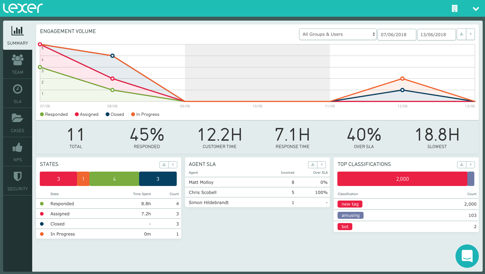
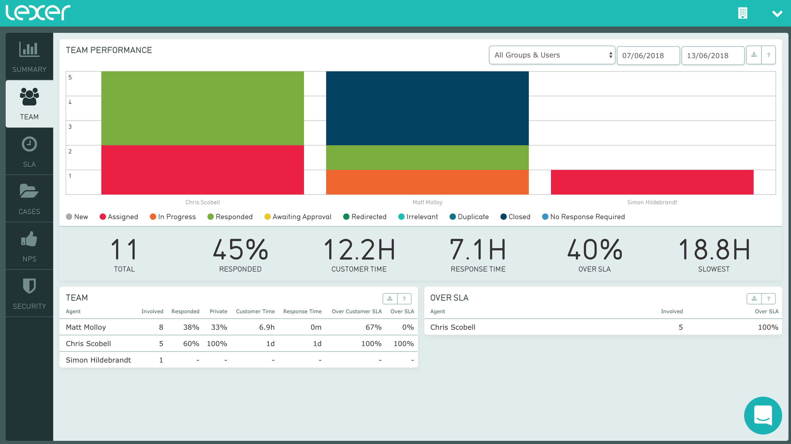
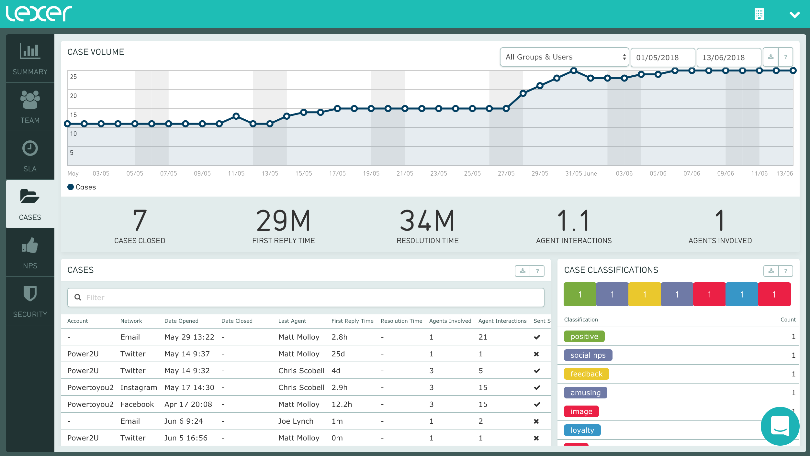
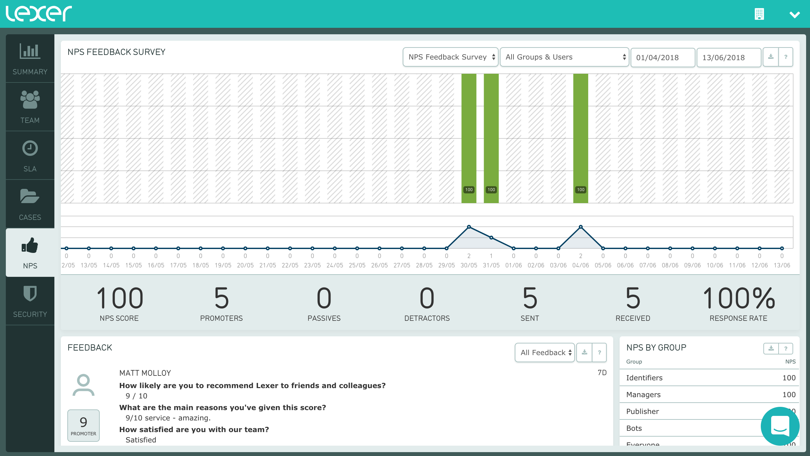

# Activity

Using the Activity API, you can retrieve performance data on your team operating within Lexer Engage. Access insightful metrics such as the number of closed cases, average response time, or your overall NPS score for last month. We’ve made your Activity data accessible so you can run bespoke reports or add them to your applications.

Our API is organised into two sections; Get and Post requests. Get requests allow you to access the user, groups and forms information related to your team. These are useful for filtering your reports. Post requests are queries that comprise of particular report types and filter parameters. Reports may be filtered by users, groups, forms and time.

## API Tokens

You will need an API token to access your Activity data. Tokens are managed within the Settings area of the Hub, and require Manager permissions to access. All endpoints require an API token to authenticate your requests.

## GET Users

Retrieve a list of users that have access to your Lexer account. You can use these user details to filter any of the Activity queries for agent specific metrics. Here we'll describe how you request and interpret this information.

```text
curl -H "Content-Type: application/json" -H "Auth-Api-Token: 12345678-1234-1234-1234-123456789" -X GET https://api.lexer.io/v1/users
```

**Endpoint**
`https://api.lexer.io/v1/users`

```json
  {
    "id": 12345,
    "email": "jane@business.io",
    "first_name": "Jane",
    "last_name": "Remington",
    "timezone": "Australia/Sydney",
    "gmtoffset": 10,
    "sign_in_count": 76,
    "last_sign_in_at": "2018-03-21T06:09:01Z",
    "archived": false,
    "groups": [
      123,
      456,
      789,
    ]
  }
```


Property | Description | Type |
---------|-------------|------|
id  | user id | number
email  | email account used to login | string
first_name  | first name of the user | string
last_name  | last name of the user | string
timezone | timezone location of user | string
gmtoffset | timezone offset of user | number
sign_in_count | count of logins | number
last_sign_in_at | date of users last login | string
archived | archived flag for user | boolean
groups | groups the user is in | array


## GET Groups

Retrieve a list of groups that exist in your Lexer account. You can use these group details to filter any of the Activity queries for team specific metrics. Here we'll describe how you request and interpret this information.

```text
curl -H "Content-Type: application/json" -H "Auth-Api-Token: 12345678-1234-1234-1234-123456789" -X GET https://api.lexer.io/v1/groups
```

**Endpoint**
`https://api.lexer.io/v1/groups`

```json

  {
    "id": 123,
    "name": "Social Customer Care",
    "comment": "Social customer care team members"
  }
```


Property | Description | Type |
---------|-------------|------|
id  | group id | number
name  | name of the group | string
comment  | description of the group | string


## GET Forms

Retrieve a list of forms/surveys that exist in your Lexer account. These include NPS surveys, authentication forms, and competition surveys. You need to specifiy the NPS Survey id when requesting the NPS Summary or NPS Volume data. Here we'll describe how you request and interpret this information.

```text
curl -H "Content-Type: application/json" -H "Auth-Api-Token: 12345678-1234-1234-1234-123456789" -X GET https://api.lexer.io/v1/forms
```

**Endpoint**
`https://api.lexer.io/v1/forms`

```json
  {
    "id": 55,
    "name": "NPS Survey",
    "title": "Lexer NPS Survey",
    "archived": false,
    "created_at": "2018-05-26T21:54:19Z",
    "groups": [
      123
    ],
    "nps": false,
    "form_url": "https://d1z1wrkt4y2iqm.cloudfront.net/123455678899876543/1/form"
  }
```


Property | Description | Type |
---------|-------------|------|
id  | group id | number
name  | name of the form | string
title  | title of the form | string
archived  | archived flag | boolean
created_at | date this form was created | string
groups | groups that have access to this form | array
nps | is this form an NPS survey? | boolean
form_url | URL to view this form | string


## Summary

Access your teams high level performance metrics - including total objects handled, response times, and classifications on these objects.



<br/><br/><br/><br/>

**Summary Metrics**

Access the summary metrics that are used to power the big number metrics you can see in Activity. This includes the number of objects handled, response count, average response time, agent handle time and a few others.


```text
curl -H "Content-Type: application/json" -H "Auth-Api-Token: 12345678-1234-1234-1234-123456789" https://api.lexer.io/v1/activity/reports -d '
{
  "type": "summary",
  "date_from": "2018-04-01T00:00:00+11:00",
  "date_to": "2018-04-30T23:59:59+11:00"
}'
```

**Endpoint**
`https://api.lexer.io/v1/activity/reports`

**Type:** summary

```json
{
  "total_volume": 7526,
  "avg_response_time": 1315.27098046203,
  "min_response_time": 50.702796,
  "max_response_time": 200663.392234,
  "avg_action_response_time": 509.337687048021,
  "min_action_response_time": 4.908278,
  "max_action_response_time": 199826.523834,
  "total_responded_to": 3582,
  "broke_sla": 166,
  "broke_action_sla": 45,
  "avg_response_time_min": 21.9211830077005,
  "avg_action_response_time_min": 8.48896145080035
}
```
Property | Description | Type |
---------|-------------|------|
total_volume | total objects handled | number
avg_response_time | average customer to reponse time in seconds | number
min_response_time | min customer to reponse time in seconds | number
max_response_time | max customer to reponse time in seconds | number
avg_action_response_time | average assign to response time in seconds | number
min_action_response_time | min assign to response time in seconds | number
max_action_response_time | max assign to response time in seconds | number
total_responded_to | objects responded to | number
broke_sla | number of objects that exceeded customer SLA time | number
broke_action_sla | number of objects that exceeded agent handle SLA time   | number
avg_response_time_min | average customer response time in minutes | number
avg_action_response_time_min | average agent handle time in minutes | number


<br/><br/><br/><br/><br/><br/>


**Summary Volume**

Daily volume of objects in each workflow state. Your response will contain an array for each state, and within that state an object for each period (i.e. each day).

```text
curl -H "Content-Type: application/json" -H "Auth-Api-Token: 12345678-1234-1234-1234-123456789" https://api.lexer.io/v1/activity/reports -d '
{
  "type": "states_volume",
  "date_from": "2018-04-01T00:00:00+11:00",
  "date_to": "2018-04-30T23:59:59+11:00"
}'
```
**Endpoint**
`https://api.lexer.io/v1/activity/reports`

**Type:** states_volume


```json
{
  "closed": [
    {
      "state": "closed",
      "value": 174,
      "date_range": {
        "date_from": "2018-04-27 00:00"
      }
    },
    {
      "state": "closed",
      "value": 234,
      "date_range": {
        "date_from": "2018-04-28 00:00"
      }
    },
    {
      "state": "closed",
      "value": 255,
      "date_range": {
        "date_from": "2018-04-29 00:00"
      }
    },
    {
      "state": "closed",
      "value": 108,
      "date_range": {
        "date_from": "2018-04-30 00:00"
      }
    }
  ]
}
```

Property | Description | Type |
---------|-------------|------|
state  | workflow state | string
value  | number of objects in this state | number
date_range  | date for value | string

**Notes:**
  Most results will be found in the 'closed' state. We suggest using this volume to map total volume over time.

  If your query range is less than 4 days the time intervals will be reduced from days to hours.


<br/><br/><br/><br/><br/><br/><br/><br/><br/><br/><br/><br/><br/><br/><br/><br/><br/><br/><br/><br/><br/>


**States**

Total volume of objects in each of the workflow states. 

```text
curl -H "Content-Type: application/json" -H "Auth-Api-Token: 12345678-1234-1234-1234-123456789" https://api.lexer.io/v1/activity/reports -d '
{
  "type": "user_volume",
  "date_from": "2018-04-01T00:00:00+11:00",
  "date_to": "2018-04-30T23:59:59+11:00"
}'
```
**Endpoint**
`https://api.lexer.io/v1/activity/reports`

**Type:** user_volume


```json
[
  {
    "state": "closed",
    "volume": 92
  },
  {
    "state": "responded",
    "volume": 49
  },
  {
    "state": "assigned",
    "volume": 26
  },
  {
    "state": "in_progress",
    "volume": 13
  },
  {
    "state": "duplicate",
    "volume": 4
  },
  {
    "state": "awaiting_approval",
    "volume": 1
  }
]
```

Property | Description | Type |
---------|-------------|------|
state  | workflow state | string
volume  | count of objects | number


<br/><br/><br/><br/><br/><br/><br/><br/><br/><br/><br/><br/><br/><br/><br/><br/><br/><br/><br/><br/><br/>


**Classifications (Objects)**

Classifications and the number of objects in each workflow state. You can get the total count for each classification using the 'all_states' value.

```text
curl -H "Content-Type: application/json" -H "Auth-Api-Token: 12345678-1234-1234-1234-123456789" https://api.lexer.io/v1/activity/reports -d '
{
  "type": "classifications",
  "date_from": "2018-04-01T00:00:00+11:00",
  "date_to": "2018-04-30T23:59:59+11:00"
}'
```
**Endpoint**
`https://api.lexer.io/v1/activity/reports`

**Type:** classifications

```json
[
  {
    "classification_id": 123,
    "classification": "amusing",
    "state": "assigned",
    "volume": 2
  },
  {
    "classification_id": 123,
    "classification": "amusing",
    "state": "all_states",
    "volume": 3
  },
  {
    "classification_id": 123,
    "classification": "amusing",
    "state": "closed",
    "volume": 1
  },
  {
    "classification_id": 143,
    "classification": "customer service",
    "state": "responded",
    "volume": 1
  },
  {
    "classification_id": 143,
    "classification": "customer service",
    "state": "all_states",
    "volume": 1
  }
]
```

Property | Description | Type |
---------|-------------|------|
classification_id |  unique id | number
classification |  name | string
state |  workflow state | string
volume |  count of classifications | number

<br/><br/><br/><br/><br/><br/><br/><br/><br/><br/><br/><br/><br/><br/><br/><br/><br/><br/><br/><br/><br/><br/><br/><br/>


**Response Time**

Returns the daily average response time for all objects handled by your team. Here we're looking at the same data that powers the SLA Performance line chat in Activity. Note that if your query range is 3 days or less, the intervals will be reduced to hourly.

```text
curl -H "Content-Type: application/json" -H "Auth-Api-Token: 12345678-1234-1234-1234-123456789" https://api.lexer.io/v1/activity/reports -d '
{
  "type": "response_volume",
  "date_from": "2018-04-01T00:00:00+11:00",
  "date_to": "2018-04-30T23:59:59+11:00"
}'
```
**Endpoint**
`https://api.lexer.io/v1/activity/reports`

**Type:** response_volume

```json
{
  "avg_response_time": [
    
    {
      "value": 317691.388907962,
      "date_range": {
        "date_from": "2018-06-05 00:00"
      }
    },
    {
      "value": 31159.3797606667,
      "date_range": {
        "date_from": "2018-06-06 00:00"
      }
    },
    {
      "value": 69850.8753626667,
      "date_range": {
        "date_from": "2018-06-07 00:00"
      }
    },
    {
      "value": 10661.255474,
      "date_range": {
        "date_from": "2018-06-08 00:00"
      }
    }
  ]
}
```

Property | Description | Type |
---------|-------------|------|
value | average response time in minutes | number
date_range | date interval  | string


## Team 

Access your teams individual performance data - including objects handled per agent, response times, and more.



<br/><br/>

**Agent Summary**

Return the performance metrics for each agent in your team. The data you access in this request is used to populate the 'Team' chart in Activity.

```text
curl -H "Content-Type: application/json" -H "Auth-Api-Token: 12345678-1234-1234-1234-123456789" https://api.lexer.io/v1/activity/reports -d '
{
  "type": "user_summary",
  "date_from": "2018-04-01T00:00:00+11:00",
  "date_to": "2018-04-30T23:59:59+11:00"
}'
```
**Endpoint**
`https://api.lexer.io/v1/activity/reports`

**Type:** user_summary

```json
[
  {
    "first_name": "Jane",
    "last_name": "Pear",
    "mentions_assigned": 12,
    "user_id": "123",
    "responded_to": 9,
    "responded_to_in_private": 6,
    "avg_response_time": 17053.3492157778,
    "min_response_time": 56.983366,
    "max_response_time": 84664.420214,
    "avg_action_response_time": 278.770835555556,
    "min_action_response_time": 7.767898,
    "max_action_response_time": 2261.353394,
    "total_responded_to": 9,
    "broke_sla": 3,
    "broke_action_sla": 0,
    "avg_response_time_min": 284.22248692962995,
    "avg_action_response_time_min": 4.6461805925926,
    "fraction_responded_to": 0.75,
    "fraction_responded_to_in_private": 0.6666666666666666,
    "fraction_broke_sla": 0.3333333333333333,
    "fraction_broke_action_sla": 0.0
  },
  {
    "first_name": "Barry",
    "last_name": "Banana",
    "mentions_assigned": 7,
    "user_id": "789",
    "responded_to": 1,
    "responded_to_in_private": 1,
    "avg_response_time": 352842.64921,
    "min_response_time": 352842.64921,
    "max_response_time": 352842.64921,
    "avg_action_response_time": 134.51357,
    "min_action_response_time": 134.51357,
    "max_action_response_time": 134.51357,
    "total_responded_to": 1,
    "broke_sla": 1,
    "broke_action_sla": 0,
    "avg_response_time_min": 5880.710820166667,
    "avg_action_response_time_min": 2.241892833333333,
    "fraction_responded_to": 0.14285714285714285,
    "fraction_responded_to_in_private": 1.0,
    "fraction_broke_sla": 1.0,
    "fraction_broke_action_sla": 0.0
  }
]
```

Property | Description | Type |
---------|-------------|------|
first_name | first name of agent | string
last_name | last name of agent | string
mentions_assigned | count of object assigned to agent | number
user_id | unique id of agent | string
responded_to | count of objects responded to | number
responded_to_in_private | count of objects responded to that are private messages | number
avg_response_time | average customer to reponse time in seconds  | number
min_response_time | average customer to reponse time in seconds  | number
max_response_time |   max customer to reponse time in seconds | number
avg_action_response_time | average assign to response time in seconds | type
min_action_response_time | min assign to response time in seconds | type
max_action_response_time | max assign to response time in seconds | type
total_responded_to | count of objects responded to | number
broke_sla | number of objects that exceeded customer SLA time | number
broke_action_sla |  number of objects that exceeded agent handle SLA time | number
avg_response_time_min | average customer response time in minutes | number
avg_action_response_time_min | average agent handle time in minutes | type
fraction_responded_to | responded_to divided by mentions_assigned | number
fraction_responded_to_in_private | responded_to_in_private divided by mentions_assigned | number
fraction_broke_sla | broke_sla divided by responded_to  | number
fraction_broke_action_sla | broke_action_sla divided by responded_to | number


<br/><br/><br/><br/><br/>


**Agent Volume**

Return the count of objects currently assigned to each agent in your team. For each team member, this will also breakdown the objects by their current workflow state.

```text
curl -H "Content-Type: application/json" -H "Auth-Api-Token: 12345678-1234-1234-1234-123456789" https://api.lexer.io/v1/activity/reports -d '
{
  "type": "user_volume",
  "date_from": "2018-04-01T00:00:00+11:00",
  "date_to": "2018-04-30T23:59:59+11:00"
}'
```
**Endpoint**
`https://api.lexer.io/v1/activity/reports`

**Type:** user_volume

```json
[
  {
    "user_id": 123,
    "first_name": "Jane",
    "last_name": "Pear",
    "states": {
      "all_states": 166,
      "all_closed_states": 110,
      "new": 0,
      "assigned": 15,
      "in_progress": 14,
      "responded": 27,
      "awaiting_approval": 0,
      "redirected": 0,
      "irrelevant": 0,
      "duplicate": 0,
      "closed": 110,
      "no_response_required": 0
    }
  },
  {
    "user_id": 789,
    "first_name": "Barry",
    "last_name": "Banana",
    "states": {
      "all_states": 4,
      "all_closed_states": 1,
      "new": 0,
      "assigned": 1,
      "in_progress": 1,
      "responded": 1,
      "awaiting_approval": 0,
      "redirected": 0,
      "irrelevant": 0,
      "duplicate": 0,
      "closed": 1,
      "no_response_required": 0
    }
  }
]
```

Property | Description | Type |
---------|-------------|------|
user_id  | unique id for agent | number
first_name  | first name of agent | string
last_name  | last name of agent | string
states  | count of each state owned by agent | array


<br/><br/><br/><br/><br/><br/><br/><br/><br/><br/><br/><br/><br/><br/><br/><br/><br/><br/><br/><br/><br/><br/><br/><br/>


## SLA

Export a complete log of all customer messages your team has triaged and replied to from Engage. Use this file if you're looking for a single master document.


## Cases


Access performance metrics on the conversations your team are having, which we call cases. This includes total case volume, first response times, resolution times, and case classifications.



<br/><br/>

**Case Summary**

Return the summary metrics for the cases your team have handled. Cases are only created when an agent responds to a customer.

```text
curl -H "Content-Type: application/json" -H "Auth-Api-Token: 12345678-1234-1234-1234-123456789" https://api.lexer.io/v1/activity/reports -d '
{
  "type": "case_summary",
  "date_from": "2018-04-01T00:00:00+11:00",
  "date_to": "2018-04-30T23:59:59+11:00"
}'
```
**Endpoint**
`https://api.lexer.io/v1/activity/reports`

**Type:** case_summary

```json
{
  "total_cases": 4,
  "first_reply_time": 1907.187351,
  "resolution_time": 1907.187351,
  "agent_interactions": 1.0,
  "agents_involved": 1.0
}
```

Property | Description | Type |
---------|-------------|------|
total_cases  | count of cases closed in this period | number
first_reply_time  | average case first reply time | number
resolution_time  | average case resolution time | number
agent_interactions  | average number of agent replies per case | number
agents_involved  | average number of agents responding per case | number


<br/><br/><br/><br/><br/>


**Case Volume**

Return the count of open cases for each day. Cases are tracked from the first customer query to the last agent response. Cases are closed 24 hours of inactivity from either the customer or the agent, provided all customer messages are in a closed state.

```text
curl -H "Content-Type: application/json" -H "Auth-Api-Token: 12345678-1234-1234-1234-123456789" https://api.lexer.io/v1/activity/reports -d '
{
  "type": "case_volume",
  "date_from": "2018-04-01T00:00:00+11:00",
  "date_to": "2018-04-30T23:59:59+11:00"
}'
```
**Endpoint**
`https://api.lexer.io/v1/activity/reports`

**Type:** case_volume

```json
{
  "open": [
    {
      "value": 9,
      "date_range": {
        "date_from": "2018-04-01 00:00"
      }
    },
    {
      "value": 9,
      "date_range": {
        "date_from": "2018-04-02 00:00"
      }
    },
    {
      "value": 9,
      "date_range": {
        "date_from": "2018-04-03 00:00"
      }
    },
    {
      "value": 9,
      "date_range": {
        "date_from": "2018-04-04 00:00"
      }
    },
    {
      "value": 9,
      "date_range": {
        "date_from": "2018-04-05 00:00"
      }
    },
    {
      "value": 10,
      "date_range": {
        "date_from": "2018-04-06 00:00"
      }
    },
    {
      "value": 9,
      "date_range": {
        "date_from": "2018-04-07 00:00"
      }
    }
  ]
}
```


Property | Description | Type |
---------|-------------|------|
value  | count of active cases | number
date_from  | date interval | string


<br/><br/><br/><br/><br/><br/><br/><br/><br/><br/><br/><br/><br/><br/><br/><br/><br/><br/><br/><br/><br/><br/><br/><br/><br/>


**Case Classifications**

Return the count of classifications applied to the cases in this time period. Classifications are only counted once per case, helping you understand the number of conversations about each topic.

```text
curl -H "Content-Type: application/json" -H "Auth-Api-Token: 12345678-1234-1234-1234-123456789" https://api.lexer.io/v1/activity/reports -d '
{
  "type": "case_classifications",
  "date_from": "2018-04-01T00:00:00+11:00",
  "date_to": "2018-04-30T23:59:59+11:00"
}'
```
**Endpoint**
`https://api.lexer.io/v1/activity/reports`

**Type:** case_classifications

```json
[
  {
    "classification_id": 466,
    "classification": "positive",
    "volume": 1
  },
  {
    "classification_id": 526,
    "classification": "social nps",
    "volume": 1
  },
  {
    "classification_id": 528,
    "classification": "feedback",
    "volume": 1
  },
  {
    "classification_id": 1246,
    "classification": "amusing",
    "volume": 1
  },
  {
    "classification_id": 1465,
    "classification": "image",
    "volume": 1
  },
  {
    "classification_id": 1467,
    "classification": "loyalty",
    "volume": 1
  },
  {
    "classification_id": 1472,
    "classification": "bot",
    "volume": 1
  }
]
```

Property | Description | Type |
---------|-------------|------|
classification_id  | unique id for each classification | number
classification  | name for each classification | string
volume  | count of classifications | number


## NPS

Access your teams NPS performance metrics - including overall score, count of detractors, promoters, passives, and your average response rate. Reminder to retrieve your forms (see GET Forms above) to retrieve a list of the NPS Surveys your team are using. The ID for your form will be used to generate the following queries.



<br/><br/>

**NPS Summary**

Return the summary metrics for the specified NPS Survey.

```text
curl -H "Content-Type: application/json" -H "Auth-Api-Token: 12345678-1234-1234-1234-123456789" https://api.lexer.io/v1/activity/reports -d '
{
  "type": "nps_summary",
  "date_from": "2018-04-01T00:00:00+11:00",
  "date_to": "2018-04-30T23:59:59+11:00",
  "form": 123,
  "nps_category": "all"
}'
```

**Endpoint**
`https://api.lexer.io/v1/activity/reports`

**Type:** nps_summary

```json
{
  "total_sent": 16,
  "total_received": 12,
  "total_promoters": 9,
  "total_passives": 1,
  "total_detractors": 2,
  "nps_score": 58.333333333333336
}
```

Property | Description | Type |
---------|-------------|------|
total_sent | count of surveys sent | number
total_received | count of responses received | number
total_promoters | count of 9-10 score responses | number
total_passives | count of 7-8 score responses | number
total_detractors | count of <7 score responses | number
nps_score | average nps score | number


<br/><br/>

**NPS Volume**

Return the daily volume of NPS scores and responses for each day in your query range.

```text
curl -H "Content-Type: application/json" -H "Auth-Api-Token: 12345678-1234-1234-1234-123456789" https://api.lexer.io/v1/activity/reports -d '
{
  "type": "nps_volume",
  "date_from": "2018-04-01T00:00:00+11:00",
  "date_to": "2018-04-30T23:59:59+11:00",
  "form": 123,
  "nps_category": "all"
}'
```

**Endpoint**
`https://api.lexer.io/v1/activity/reports`

**Type:** nps_volume

```json
[
  {
    "date": "2018-04-01T13:00:00+00:00",
    "timestamp": 1522587600,
    "data": {
      "total_sent": 0,
      "total_received": 0,
      "total_promoters": 0,
      "total_passives": 0,
      "total_detractors": 0,
      "nps_score": 0.0
    }
  },
  {
    "date": "2018-04-02T13:00:00+00:00",
    "timestamp": 1522674000,
    "data": {
      "total_sent": 0,
      "total_received": 0,
      "total_promoters": 0,
      "total_passives": 0,
      "total_detractors": 0,
      "nps_score": 0.0
    }
  },
  {
    "date": "2018-04-03T13:00:00+00:00",
    "timestamp": 1522760400,
    "data": {
      "total_sent": 0,
      "total_received": 0,
      "total_promoters": 0,
      "total_passives": 0,
      "total_detractors": 0,
      "nps_score": 0.0
    }
  },
  {
    "date": "2018-04-04T13:00:00+00:00",
    "timestamp": 1522846800,
    "data": {
      "total_sent": 0,
      "total_received": 0,
      "total_promoters": 0,
      "total_passives": 0,
      "total_detractors": 0,
      "nps_score": 0.0
    }
  },
  {
    "date": "2018-04-05T13:00:00+00:00",
    "timestamp": 1522933200,
    "data": {
      "total_sent": 0,
      "total_received": 0,
      "total_promoters": 0,
      "total_passives": 0,
      "total_detractors": 0,
      "nps_score": 0.0
    }
  },
  {
    "date": "2018-04-06T13:00:00+00:00",
    "timestamp": 1523019600,
    "data": {
      "total_sent": 0,
      "total_received": 0,
      "total_promoters": 0,
      "total_passives": 0,
      "total_detractors": 0,
      "nps_score": 0.0
    }
  },
  {
    "date": "2018-04-07T13:00:00+00:00",
    "timestamp": 1523106000,
    "data": {
      "total_sent": 0,
      "total_received": 0,
      "total_promoters": 0,
      "total_passives": 0,
      "total_detractors": 0,
      "nps_score": 0.0
    }
  }
]
```

Property | Description | Type |
---------|-------------|------|
date | date time in UTC | string
timestamp | date time in Epoch time | number
total_sent | count of surveys sent | number
total_received | count of responses received | number
total_promoters | count of 9-10 score responses | number
total_passives | count of 7-8 score responses | number
total_detractors | count of <7 score responses | number
nps_score | average nps score | number


## Errors

The API may return the following error codes.

Code | Type | Description |
---------|-------------|------|
400 | Invalid report - date range is too long | Your date range must be not greather than 12 months
400 | Invalid report - starting date is a future date | Starting date must be in the past
400 | Invalid report - invalid type| Chart type provided is invalid
401 | Unauthorized - api token not matching| Your API token provided is not valid
401 | Unauthorized | missing authentication data | API token is missing
404 | Not found | General error for malformed request
429 | Rate limited exceeded | You're making too many requests


## Rate Limiting

The API may rate limit requests made by your application. Our rate limits are managed by an allowed number of requests per time window. A single request could be to retrieve a list of users, or query a particular chart endpoint. 

The rate limit is **100 requests per 5 minutes per API Token.**

In the case you are rate limited a "429 Rate limited exceeded" response will be returned.