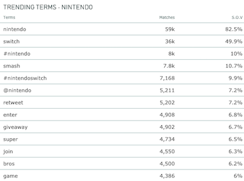
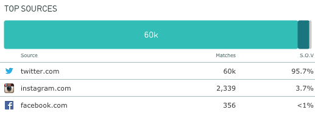
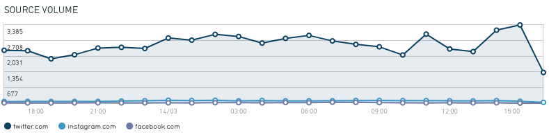
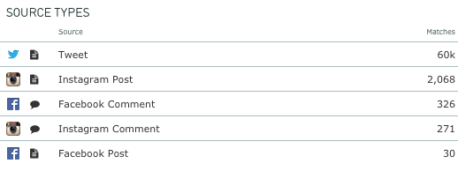
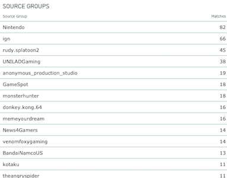
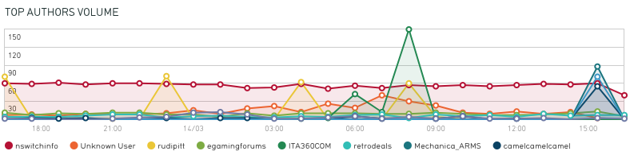

# Content

Our Content API allows you to access social and news content in a simple JSON format. Your queries are defined by saved dives within Listen, and your endpoints are retrieved from the Command charts they are connected to. Once you have a chart displaying in Command, simply click on the small link button in the top right corner.

Read our [help article](https://learn.lexer.io/export-and-report/command/command-screens) for details on building a Command screen or contact support via live chat or at [support@lexer.io](mailto:support@lexer.io).

## Prerequisites

- **Listen**: to create your saved dives that define your search.
- **Command**: to create the charts using your saved dives.


## Configuration

Unlike traditional APIs, your requests for the Content API must be created from our live dashboard feature Command. Your Command screen allows you to test and visualise the results before retrieving the API endpoint. Once you're happy with the results, simply click the link button on the top right corner of the chart and your request will be provided in the URL.

### Endpoints
```text
https://clients.lexer.io/api/clients/{account_id}/screens/{screen_id}/charts/{chart_id}/result?client_token={client token}
```
Retrieved from each chart in your screen, endpoints look like the example displayed to the right. They always include the account id, screen id, chart id, and your client token. Note that Command screens are designed for public use and can be accessed without authentication.

All of your requests should match this format.


### Parameters
```text
;date_ending=2018-02-21
```
Requests can be modified with two paramaters to adjust the date range or filter for specific terms.

Append date_ending to adjust the ending date of your query. This will adjust the time window of your chart to finish at this day or time.

```text
;terms=lexer
;terms=lexer%20OR%20data
```

Append terms to filter your saved dive even further. Here we're filtering for mentions of *Lexer OR Data*. Tip: it's easier to define this from your saved dive within Listen!


## Summary Metrics

Here we'll describe the summary bar and live stream volume charts.

### Summary Bar
```json
{
  "id": 18041857,
  "updated_at": "2018-03-13T02:04:04Z",
  "data": {
    "mentions": 71200,
    "sources": 3,
    "authors": 47134,
    "reach": 309297204,
    "average_engagements": 1.5105868375
  }
}
```

The summary bar displays the headline metrics for your saved dive. Each of the individual big number charts (i.e. Matches, Authors) uses the same query and will return all of the results.

- `mentions`: the total number of objects matching your query.

- `sources`: where the content has come from i.e. Twitter.

- `authors`: unique authors that have published this content.

- `reach`: sum of the followers for each author.

- `average_engagements`: mentions divided by authors.


### Live Stream Volume
```json
{
  "id": 17633606,
  "updated_at": "2018-02-22T03:14:51Z",
  "data": {
    "Nintendo": {
      "data": {
        "1519185600000": 1459,
        "1519189200000": 1284,
        "1519192800000": 1243,
        "1519196400000": 1123,
        "1519200000000": 1422,
        "1519203600000": 1295,
        "1519268400000": 364
      },
      "original": [...],
      
      "summary": {
        "current": {
          "mentions": 39564
        }
      },
      "id": 5448,
      "color": "#ed1941"
    }
  }
}
```
The Live Stream Volume chart will return a data object for each filter presented in the chart. In this example we're just looking at the Nintendo filter. Within this object are the count of mentions for each time interval.

Also included in this response is the total number of mentions and various other information to render this in the chart interface.

Our volume charts bucket counts into time intervals based on the period covered in the report. Here is a summary of the query ranges and corresponding time intervals returned.

- `<2 days`: results are grouped into 1 hour intervals.

- `2-3 days`: results are grouped into 3 hour intervals.

- `7 days`: results are grouped into 12 hour intervals.

- `8+ days`: results are grouped into 1 day intervals.


Note: all of our volume over time charts are returned using unix time.


## Mentions

Let's take a closer look at the mention objects that are displayed in the Recent Mentions, Influential Mentions, and Recent Media charts. Each of these charts returns the top 100 hits for the query, allowing you to recreate a display feed of content in your app.

### Recent & Influential Mentions


Here we'll review a Tweet from the @camplexer account. Let's take a closer look in the table below. Most of the data you need to recreate a mention is contained within the _data_ object. The _original_ object is what we receive from the source, and will give you access to the media content (image or video) attached to the object. We suggest referring to the Twitter, Facebook or Instagram API documentation for more on the structure of the results.

```json
{
  "id": [...],
  "data": {
    "content": "Ahead of #eTailWest, we’ve launched our 2018 Data Culture Study. This annual study benchmarks the opportunities in customer data and the actions you can take to capitalize on them: http://lexer.link/2CccBM0 ⚡ https://t.co/BG1n6IpJka",
    "geography": {
      "accuracy": "guessed",
      "code": "AU/VIC",
      "point": {
        "lat": -37.814107,
        "lon": 144.96328
      }
    },
    "mentions": {
      "links": [
        "t.co/BG1n6IpJka",
        "lexer.link/2CccBM0"
      ],
      "mentions": [],
      "authors": [],
      "author_ids": []
    },
    "terms": [
      "benchmarks",
      "capitalize",
      "opportunities",
      "ahead",
      "culture",
      "actions",
      "#etailwest",
      "customer",
      "annual",
      "study",
      "data",
      "launched"
    ],
    "source": {
      "name": "twitter.com",
      "group": [],
      "id": 102,
      "type": [
        "image",
        "link"
      ]
    },
    "author": {
      "id": "twitter_219052087",
      "fullname": "Lexer",
      "username": "camplexer",
      "link": "https://twitter.com/camplexer/",
      "bio": "Put data to work to genuinely understand and engage customers.",
      "avatar": "https://pbs.twimg.com/profile_images/595397359808356352/ULzphDZ__normal.png",
      "influence": 0.506,
      "reach": {
        "inbound": 1081,
        "outbound": 942
      }
    },
    "engagements": {
      "comments": 0,
      "likes": 0,
      "shares": 0
    },
    "engagement_count": 0,
    "language": "en",
    "link": "https://twitter.com/camplexer/statuses/967621409668177920",
    "original": [...],
    "id": "967621409668177920",
    "published": "2018-02-25T04:44:56Z",
    "processed": "2018-02-25T04:44:57Z",
    "_id": "twitter_967621409668177920"
  },
  "original": [...]
}
```

Property | Description |
---------|-------------|
content  | Body of the message.
geography.accuracy | Supplied if specifically provided with the content. Guessed if inferred from the account settings. Uknown if no location data is provided.
geography.code | Country code provided for this location.
geography.point | Latitude and longitude points.
mentions.links | Array of links in the content.
mentions.mentions | Objects mentioned i.e. a retweet.
mentions.authors | Authors tagged in the content.
mentions.author_ids | IDs of the authors tagged in the content.
terms | Tokenized words extracted from the content.
source.name | Domain name for the source.
source.group | Facebook or Instagram account the content lives on. Empty for Twitter.
source.id | Numeric ID associated with the source type. See Sources > Source Types for more information.
source.type | Image, video, link, text. Image and video are mutually exclusive. An object may be type video,link or image,link. Text indicates no media or links.
author.id | Author ID appended with the network prefix.
author.fullname | Display name of the author.
author.username | Username of the author i.e Twitter handle.
author.link | URL to the author's account.
author.bio | Bio description for the author.
author.avatar | URL to the author's avatar image.
author.influence | Lexer calculated influence score.
author.reach.inbound | Count of users this account is following.
author.reach.outbound | Count of followers.
engagements | Unused. We do not collect engagement metrics on objects.
engagement_count | Unused. We do not collect engagement metrics on objects.
language | Language code in ISO 639-1 format.
id | Unused.
link | URL to the content.
published | Date and time this content was created.
processed | Date and time this content was processed in Lexer.
_id | Unused.


### Paging Results

In order to return more than 100 matches, you can page through the results using the timestamp of the last object returned. Simply add the `date_ending` parameter to your next call using the `data.published` time (minus one second so as not to include the same object again) and you will return the next 100 matches.

For example if the 100th object in our result has `"published": "2018-02-25T04:30:00Z",` then you would add `;date_ending=2018-02-25T04:39:99Z` to the end of your request.


## Terms
Let's take a closer look at how we analyse trending words used in the content matching our query. Here we have the Trending Terms and Terms Volume charts. It's important to note that we remove stop words before tokenizing content.

### Trending Terms
```json
{
  "id": 18119110,
  "updated_at": "2018-03-14T05:24:35Z",
  "data": [
    {
      "term": "nintendo",
      "count": 59123
    },
    {
      "term": "switch",
      "count": 36034
    },
    {
      "term": "#nintendo",
      "count": 8014
    },
    {...}
  ]
}
```
Our trending terms table is the simplest way to return counts for terms appearing in your query. This endpoint will return the top 100 terms sorted by volume.



### Terms Volume
```json
{
  "id": 18119109,
  "updated_at": "2018-03-14T16:17:58+11:00",
  "data": {
    "nintendo": {
      "data": {
        "1520859600000": 2131,
        "1520863200000": 2536,
        "1520866800000": 2562,
        "1520870400000": 2626,
        "1520874000000": 2568,
        "1520877600000": 2234,
        "1520881200000": 2768,
        "1520884800000": 3109,
        "1520888400000": 2720,
        "1520892000000": 3466,
        "1520895600000": 2643,
        "1520899200000": 3000,
        "1520902800000": 3790,
        "1520906400000": 3148,
        "1520910000000": 3200,
        "1520913600000": 3092,
        "1520917200000": 2457,
        "1520920800000": 1919,
        "1520924400000": 1931,
        "1520928000000": 1598,
        "1520931600000": 1799,
        "1520935200000": 1921,
        "1520938800000": 2057,
        "1520942400000": 1988
      },
      "original": [...],
      "summary": null
    },
    "switch": {...},
    "#nintendo": {...},
    "smash": {...},
    "#nintendoswitch": {...},
    "retweet": {...},
    "enter": {...},
    "giveaway": {...},
    "super": {...},
    "join": {...}
  }
}
```
Here we're returning an object for each of the top 10 terms for this query. Remember that our time intervals are determined by the range of our query, as mentioned in the Summary section above.

Note that you can ignore the data in the original section.


## Sources
Sources are the social networks or websites the content has come from. We categorise this content in different ways to help you dig deeper. Let's take a closer look at the Top Sources, Sources Volume, Source Types and Source Groups charts.

### Top Sources
```json
{
  "id": 18041879,
  "updated_at": "2018-03-14T05:45:18Z",
  "data": [
    {
      "term": "twitter.com",
      "count": 61076
    },
    {
      "term": "instagram.com",
      "count": 2356
    },
    {
      "term": "facebook.com",
      "count": 357
    }
  ]
}
```
Our Top Sources chart provides you with a count of matches for each source. The `term` field refers to the source name, and the `count` field will provide the number of matches.




<br/><br/><br/><br/><br/><br/>


### Sources Volume
```json
{
  "id": 18148227,
  "updated_at": "2018-03-14T05:45:18Z",
  "data": {
    "twitter.com": {
      "data": {
        "1520920800000": 2287,
        "1520924400000": 2269,
        "1520928000000": 1919,
        "1520931600000": 2094,
        "1520935200000": 2385,
        "1520938800000": 2416,
        "1520942400000": 2366,
        "1520946000000": 2820,
        "1520949600000": 2727,
        "1520953200000": 2977,
        "1520956800000": 2886,
        "1520960400000": 2598,
        "1520964000000": 2804,
        "1520967600000": 2932,
        "1520971200000": 2693,
        "1520974800000": 2543,
        "1520978400000": 2439,
        "1520982000000": 2085,
        "1520985600000": 2987,
        "1520989200000": 2346,
        "1520992800000": 2230,
        "1520996400000": 3160,
        "1521000000000": 3384,
        "1521003600000": 1729
      },
      "original": [...],
      "summary": null
    },
    "instagram.com": {...},
      "original": [...],
      "summary": null
    },
    "facebook.com": {...},
      "original": [...],
      "summary": null
    }
  }
}
```
The Source Volume chart will return an object for each source in your result, and will break this into time intervals based on your query length. 




<br/><br/><br/><br/><br/><br/>


### Source Types
```json
{
  "id": 18041880,
  "updated_at": "2018-03-14T05:45:18Z",
  "data": [
    {
      "term": 102,
      "count": 61076
    },
    {
      "term": 122,
      "count": 2080
    },
    {
      "term": 113,
      "count": 327
    },
    {
      "term": 123,
      "count": 276
    },
    {
      "term": 112,
      "count": 30
    }
  ]
}
```
Source Types go further into breaking down the source results into their specific content type, for example posts vs comments vs private messages. 



You will notice that we return numeric IDs for each of the sources. Below is a table you should store as reference for each of the source types in our platform.

ID | Source Type
---------|-------------|
102 | Twitter Tweet
103 | Twitter Direct Message
112 | Facebook Post
113 | Facebook Comment
114 | Facebook Message
115 | Facebook Dark Post
116 | Facebook Dark Comment
117 | Facebook Review
118 | Facebook Review Comment
122 | Instagram Post
123 | Instagram Comment
132 | News/Blog Post


### Source Groups
```json
{
  "id": 18041881,
  "updated_at": "2018-03-14T05:51:04Z",
  "data": [
    {
      "term": "Nintendo",
      "count": 82
    },
    {
      "term": "ign",
      "count": 66
    },
    {
      "term": "rudy.splatoon2",
      "count": 45
    },
    {
      "term": "UNILADGaming",
      "count": 38
    },
    {
      "term": "anonymous_production_studio",
      "count": 19
    },
    {
      "term": "GameSpot",
      "count": 18
    },
    {
      "term": "monsterhunter",
      "count": 18
    },
    {
      "term": "donkey.kong.64",
      "count": 16
    },
    {
      "term": "memeyourdream",
      "count": 16
    },
    {
      "term": "News4Gamers",
      "count": 15
    },
  ]
}
```
Source groups are used for Facebook and Instagram to query or analyse content that exists on a specific page. For example, if we were to ask for all content on the source group "camplexer" we return all posts, comments and messages on this page.

This endpoint will return the top 100 source groups for your query.



## Authors
Authors are the creators of our content. 

### Engaged Authors


### Influential Authors


### Authors Volume




## Locations

Top locations

## Classifications

Classification counts

